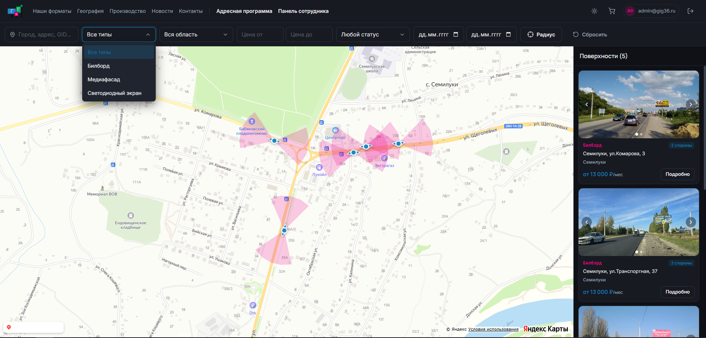
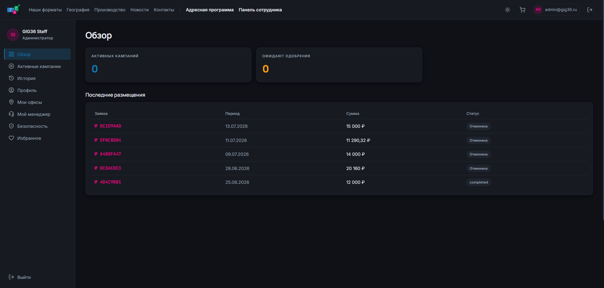
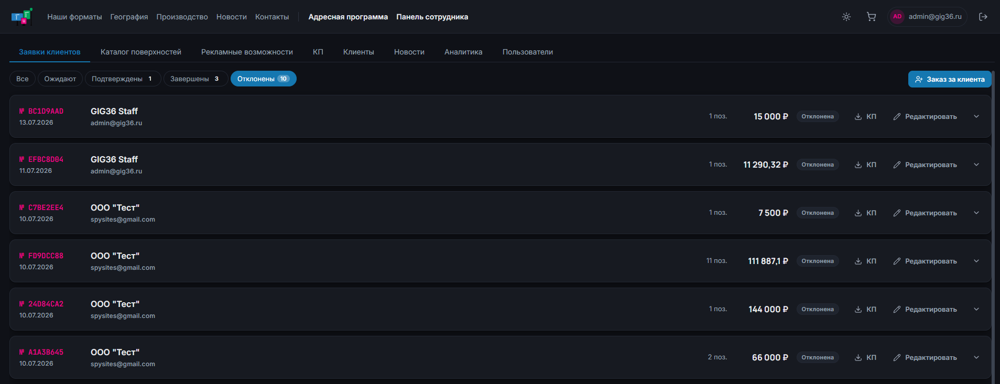

# GIG36 — платформа бронирования наружной рекламы

[](https://gig36.ru)
[](#)

Рабочая система для оператора наружной рекламы: интерактивная карта носителей,
онлайн-бронирование, кабинет клиента и панель сотрудника с каталогом, отчётами
и генерацией документов.

> **Почему нет кода.** Это витрина проекта, а не заброшенный репозиторий.
> Исходники закрыты — система в продакшене и содержит коммерческие данные
> оператора. Ниже — что она делает и как устроена внутри.

---

<!-- СКРИНШОТЫ: раскомментировать, когда в screenshots/ появятся map.png,
     cabinet.png и staff.png. Пока файлов нет, GitHub рисует битые картинки,
     поэтому секция скрыта. Требования к кадрам — в screenshots/README.md.

## Скриншоты

### Адресная программа
Карта с кластеризацией носителей, фильтрами и списком, синхронизированным
с видимой областью карты.



### Кабинет клиента
Активные кампании, история размещений, реквизиты и документы.



### Панель сотрудника
Каталог поверхностей, заявки клиентов, отчёт «Рекламные возможности»,
формирование КП.



---
-->

## Что решает

Оператор наружной рекламы продаёт рекламные поверхности — билборды и
светодиодные экраны в нескольких регионах. До системы это был обмен
Excel-файлами: менеджер вручную сверял занятость, собирал коммерческие
предложения в Word и выставлял счета по памяти.

Платформа закрывает весь цикл: **клиент находит носитель на карте →
бронирует онлайн → менеджер подтверждает → система выпускает КП и счёт**.

### Три роли

| Роль | Что может |
|---|---|
| **Клиент** | Карта и каталог, корзина, бронирование, свои кампании, реквизиты, документы |
| **Менеджер** | Заявки клиентов, оформление заказа за клиента, КП без создания заявки, отчёт занятости, карточки клиентов |
| **Администратор** | Всё вышеперечисленное + редактирование каталога, управление ролями и пользователями |

### Ключевые возможности

- **Поиск по радиусу** — «покажи всё в 5 км от этой точки», с сортировкой по фактическому расстоянию
- **Занятость на период** — карта показывает, что свободно именно в выбранные даты, а не «вообще сейчас»
- **Выгрузка в XLSX** — каталог и матричный отчёт занятости по месяцам, в двух вариантах: для менеджера (с названиями арендаторов) и для клиента (только «занято»)
- **Генерация документов** — коммерческое предложение в PDF и счёт на оплату в XLSX по шаблону оператора
- **Ссылка на поверхность** — менеджер отправляет клиенту прямую ссылку на карточку носителя, она открывается без регистрации

---

## Стек

**Фронтенд**
- Vue 3 (Composition API, `<script setup>`)
- TypeScript
- Vite
- Pinia
- Яндекс.Карты JS API 3.0
- AG Grid — редактируемый каталог для администратора

**Бэкенд**
- FastAPI (async)
- PostgreSQL + PostGIS
- SQLAlchemy Core, Alembic
- reportlab — PDF, openpyxl — XLSX

**Инфраструктура**
- Docker Compose, Caddy (TLS), GitHub Actions → автодеплой на push в `master`

---

## Технические детали

Здесь то, что интереснее всего было решать.

### Поиск по радиусу на PostGIS

Наивная реализация сравнивает разницу координат — и «5 км» превращается в
эллипс, растянутый по долготе, потому что градус долготы в Воронеже короче
градуса широты почти вдвое. Приведение к `geography` считает по сфере,
в настоящих метрах:

```sql
WHERE ST_DWithin(
        c.geo::geography,
        ST_MakePoint(:lon, :lat)::geography,
        :radius_m
      )
ORDER BY ST_Distance(c.geo::geography, ST_MakePoint(:lon, :lat)::geography)
```

Сортировка по расстоянию — не косметика: менеджер подбирает носители вокруг
точки продаж клиента, и порядок «ближе → дальше» это и есть ответ на его вопрос.

### Стороны носителя — одна точка на карте, но разный товар

У билборда две стороны (А и Б) на одних координатах: разное направление
движения, разная цена, продаются независимо. На карте два маркера в одной
точке накладываются друг на друга и не кликаются.

Стороны схлопываются в одну точку карты, но остаются раздельными позициями
в каталоге и в брони. Клик по такой точке открывает список сторон, а не
случайную из них.

### Сектор обзора вместо стрелки

У каждой стороны есть компасный азимут. Показывать его стрелкой мало —
клиент хочет понимать, *откуда* носитель видно. Рисуется полупрозрачный
сектор обзора: на веб-карте геополигоном, а в PDF-предложении — растровой
заливкой поверх статической карты, с тем же углом и цветом. Одна и та же
геометрия считается дважды под разные носители вывода.

### Занятость периода одним выражением

Носитель занят, если стоит ручная пометка оператора **или** его даты
пересекает живая бронь. Обе причины сведены в одно SQL-выражение, которое
подставляется и в список, и в карточку, и в матричный отчёт — чтобы карта,
календарь и выгрузка не могли разойтись в ответах:

```sql
CASE
    WHEN c.status = 'inactive' THEN 'inactive'
    WHEN c.status = 'occupied'
         AND (c.occupied_until IS NULL OR c.occupied_until >= :period_start)
        THEN 'occupied'
    WHEN EXISTS (SELECT 1 FROM booking_items bi
                 JOIN bookings b ON b.id = bi.booking_id
                 WHERE bi.construction_id = c.id
                   AND b.status IN ('pending', 'confirmed')
                   AND bi.duration_sec IS NULL
                   AND bi.start_date <= :period_end
                   AND bi.end_date >= :period_start)
        THEN 'occupied'
    ELSE 'active'
END
```

Светодиодные экраны из проверки исключены намеренно: там продаются секунды
в общем плейлисте, и несколько рекламодателей на одном экране — норма,
а не конфликт.

### Защита от двойной продажи

Проверка пересечения дат стоит на всех путях записи — оформление клиентом,
заказ за клиента, добавление позиции, сдвиг дат и подтверждение заявки.
Строки носителей блокируются `SELECT … FOR UPDATE` **до** проверки: без
этого два одновременных оформления проходят валидацию параллельно и оба
записывают бронь.

Отдельный случай — подтверждение: заявка может пролежать в статусе
«ожидает», пока те же даты подтвердят в другой. Поэтому проверка повторяется
в момент подтверждения, а не только при создании.

### Документы, которые не стыдно отправить клиенту

- **Коммерческое предложение** — PDF с фотографией носителя, картой с
  маркером и офисами клиента, характеристиками и итоговой таблицей.
  Два формата: карточный и табличный.
- **Счёт на оплату** — XLSX, собирается по реальному шаблону оператора
  с сохранением объединённых ячеек и стилей при вставке строк.
  Сумма прописью — собственная реализация для русского языка со
  склонением: «Тридцать семь тысяч рублей 00 копеек».

---

## Масштаб

| | |
|---|---|
| Носителей в каталоге | 239 в 32 городах |
| Регионов | 8 |
| Бэкенд | 70 модулей, 186 тестов |
| Фронтенд | 48 компонентов |
| Миграций БД | 25 |

---

<sub>Проект в продакшене. По вопросам — через контакты на сайте.</sub>
